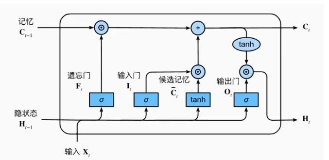
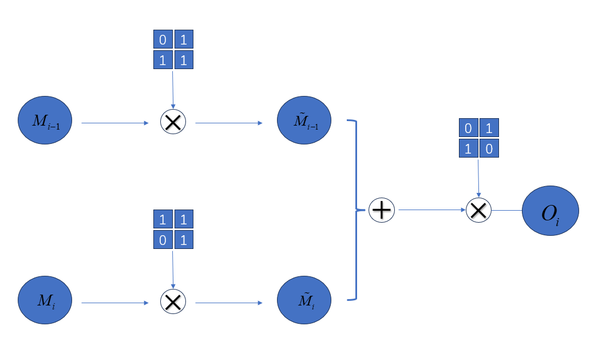
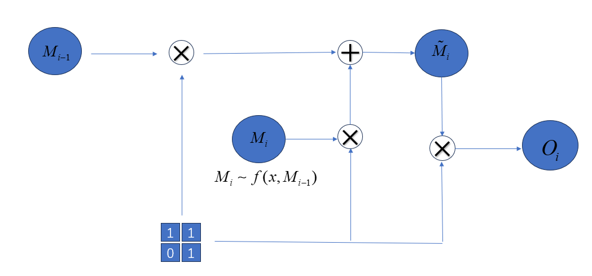
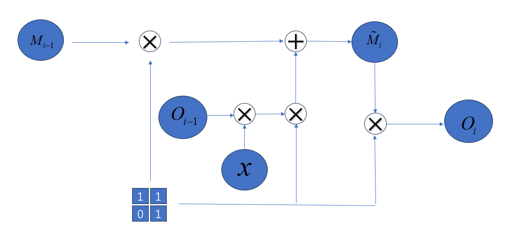
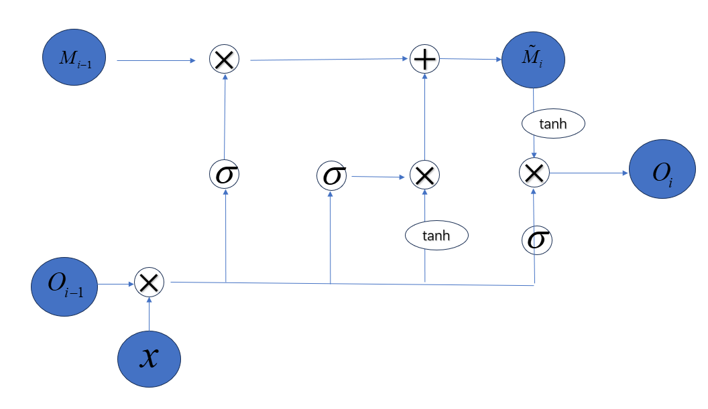

### 5分钟快速了解LSTM

参考了该链接：(https://www.bilibili.com/video/BV1qM4y1M7Nv/?spm_id_from=333.337.search-card.all.click&vd_source=4796d555437bfb1eccf419aa02339509)

#### 1.思路

**RNN**：想把所有的信息都记住，不管有没有用

**LSTM**：管一管有没有用，具备自主选择信息记忆的功能

**举个栗子**：大学考试大多数都是对考点知识的记忆而不是整书（毛概的闭卷）

**怎么管？**通俗点就是加注意力，加权重呗

#### 2.怎么理解并牢记LSTM的网络架构

第一眼你是不是很困惑为什么这么设计，非要从数学角度去推导吗？

**首先你得知道三个门控在干嘛？**

1.forget  gate:上一轮记忆全都有用吗

2.input gate:本轮的记忆都有用吗

3.output gate:上一轮和本轮记忆之和都有用吗

**举个栗子：**

背景：你在进行连续的期末考试

forget gate：考英语（物理）时需要记住上一轮数学考试的知识吗？显然不同考试对上一轮的要求不一样

input gate: 本轮考试需要对整本书进行记忆吗？是不是进行考点记忆好点呢？

output gate: 你对上一轮的记忆+本轮的记忆在该场考试中能得多少分呢，你全部记住一定得满分吗？

个人录制了视频怎么从三个门控推出网络结构且不易遗忘：https://www.bilibili.com/video/BV1oWUsBXEXh/?spm_id_from=333.1387.list.card_archive.click

